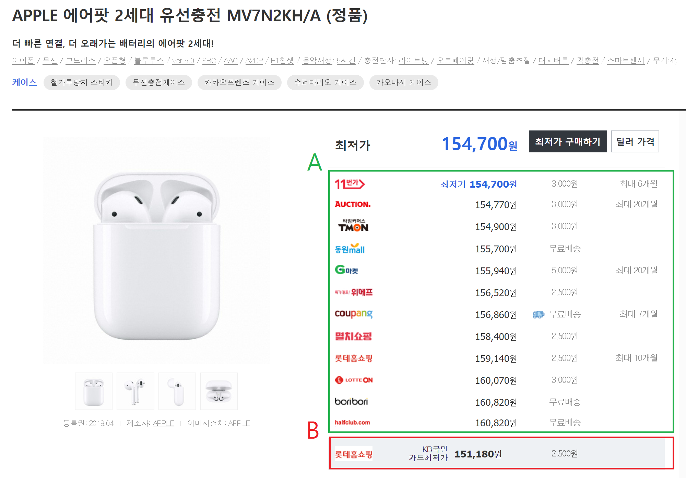

# 다나와 최저가 알림

## 개요

`alert_lowestPrice`는 원하는 제품의 최저가가 갱신되면 알림을 보내기 위한 목적으로 제작되었습니다.

해당 쇼핑몰들 중 최저가를 crawl하고 기록하여 비교하는 방식으로 진행합니다.


## 실행 과정

1. 가격비교사이트인 `danawa`의 상품 페이지에 접속 (`추가 설명` 참고)
2. 12개의 쇼핑몰에서 가격, 주소 등을 수집 후 리스트에 저장 (`추가 설명` 참고)
3. 저장한 요소들을 다듬고 가장 저렴한 쇼핑몰을 선별
4. 이전에 수집했던 정보와 `실행과정 3.`에서 선별한 쇼핑몰 정보를 비교
5. 새로 선별한 쇼핑몰이 더 저렴하면 `Telegram` 봇을 통해 알림

위의 과정을 지정한 시간마다 반복합니다.


## 요구 사항

- 언어: `Python 3.x`

- 모듈: `requests`, `time`, `json`, `sys`, `BeautifulSoup`, `telegram`, `datetime`, `os`, `source.py`

  ### 설치 과정

  - `Python`: https://www.python.org/downloads/

  - `telegram`: https://telegram.org/

    *텔레그램 봇을 만들고 api토큰등을 발급 받는 방법은 포털 창에  "텔레그램 봇 만들기" 라고 검색해주세요.*

  - `pip` (*`Python` 설치가 선행되어야 합니다.*)

    ***본 항목은 `Windows`를 기준으로 작성합니다.***
    
    ```bash
    pip install requests
    pip install python-telegram-bot
    pip install beautifulsoup4
(선택)pip install lxml
    ```

    위 명령어들을 `cmd` (명령 프롬프트)에 입력하면 됩니다.
  
    `lxml`같은 경우 `html.parser`를 사용하신다면 설치하지 않으셔도 됩니다.
  
    

  ### 파일 관련

  main 파일인 `danawa.py`와 함수를 모아놓은 `source.py` 가 있습니다. 따라서 `danawa.py`만 실행하시면 됩니다.

  **다만, 실행을 위해 필요한 데이터가 `info`폴더 내에 있습니다.**

  **여기서는 그 데이터를 채워넣는 과정을 설명합니다.**

  *json파일은 딕셔너리 형태로 불러올 수 있도록 {"`KEY"`:"`VALUE`"}형식을 따르며 큰따옴표는 지우지 않습니다.*
  
  #### `wait_time.txt`

  ```
N
  ```

  `N`에 몇 분마다 새로고침 할 건지 분 단위로 넣습니다. ex) `30`을 넣을 경우 30분 간격으로 실행

  ***숫자만 넣으셔야 실행됩니다. `30분`(X) `30`(O)***

  *1분 미만은 `0.5`(30초) 등 소수를 넣으면 되지만 추천드리지는 않습니다. (사실 안해봤어요..)*
  
  #### `telegram.json`
  
  ```json
  {
    "token": "Your_token",
      "chat_id": "Your_id"
}
  ```

  `Your_token`과 `Your_id`에 발급받은 자신의 텔레그램 API_token과 Chat ID을 넣습니다.
  
  #### `web.json`
  
  ```json
  {
      "User-Agent": "Mozilla/5.0 (Windows NT 10.0; Win64; x64) AppleWebKit/537.36 (KHTML, like Gecko) Chrome/81.0.4044.138 Safari/537.36 Edg/81.0.416.77",
      "url": "Your_url",
      "selection_mallList": "tbody[class=high_list] > tr",
      "selection_price": "td[class=price] > a > span[class=txt_prc] > em",
    "selection_shippingCost": "td[class=ship] > div > span",
      "selection_href": "td[class=price] > a"
}
  ```

   `Your_url`에 최저가를 검색할 상품 페이지 사이트 주소를 넣으면 됩니다. (`추가 설명` 참고)

  일반적인 상황에서는 `url`말고는 건드리지 않아도 됩니다.
  
  *혹시나 해서 샘플로 `web(sample).json`을 만들어놓았으니 참고해주세요.*
  
  

## 추가 설명

- 상품 페이지 관련

  

  (예시 페이지: [http://prod.danawa.com/info/?pcode=7658077&keyword=에어팟 2&cate=1029029](http://prod.danawa.com/info/?pcode=7658077&keyword=에어팟 2&cate=1029029))
  
  `실행과정 1, 2`와 `web.json`에서 언급했던 상품 페이지는 위와 같습니다.
  
  12개의 쇼핑몰이란 A에 속해있는 쇼핑몰을 의미하고 B는 수집하지 않습니다.
  
  `request.get()`으로 접속할 때 이 `url`로 접속합니다.
  
  **따라서 원하는 상품 페이지`url`을 `web.json`에 추가하실 때 위와 같은 화면의 `url`이어야 합니다.**
  
  
  
- `mall_list.json`, `lowest_mall.json`파일 관련

  - `mall_list.json`

    지정한 시간마다 수집한 정보들을 기록하는 용도로 실제 작동과는 관련없습니다.

    아래와 같은 형식으로 기록됩니다.

    ```json
    [
        {
            "price": 154700,
            "shippingCost": 3000,
            "total": 157700,
            "href": "http://prod.danawa.com/bridge/loadingBridge.html?cate1=224&cate2=49729&cate3=49740&cate4=0&pcode=7658077&cmpnyc=TH201&safe_trade=4&fee_type=T&link_pcode=2798152167&package=0&setpc=0"
        },
        {
            "price": 154900,
            "shippingCost": 3000,
            "total": 157900,
            "href": "http://prod.danawa.com/bridge/loadingBridge.html?cate1=224&cate2=49729&cate3=49740&cate4=0&pcode=7658077&cmpnyc=TN920&safe_trade=4&fee_type=T&link_pcode=2289559930&package=0&setpc=0"
        }
        ...
    ]
    ```
    
  - `lowest_mall.json`
  
    지정한 시간마다 수집한 정보 중 가장 저렴한 한 곳을 기록합니다.
  
    이 파일의 내용과 새로 수집한 내용을 비교합니다.
  
    아래와 같은 형식으로 기록됩니다.
  
    ```python
    {
        "price": 152620,
        "shippingCost": 3000,
        "total": 155620,
        "href": "http://prod.danawa.com/bridge/loadingBridge.html?cate1=224&cate2=49729&cate3=49740&cate4=0&pcode=7658077&cmpnyc=TH201&safe_trade=4&fee_type=T&link_pcode=2798152167&package=0&setpc=0"
    }
    ```
## 기타

지적이나 조언은 언제든 환영합니다! hsl99123@naver.com이나 ssu9211@gmail.com으로 문의 주세요!!


## 패치 내역

(2022-05-26) 첫 github 등록!


-2022.05.26 21:40-